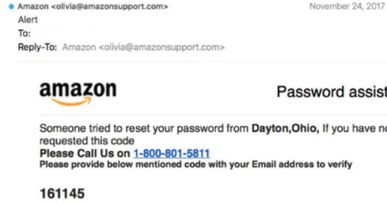

## Chains and avenues of fraud
chains and avenues of fraud have insightfully become broader in everyday contexts for instance; analogue fraud/ offline fraud and digital fraud have both taken shape in most societies thus individuals becoming prone to these vices.  

## Methods of fraud
These chains and avenues of fraud include;

## Cellular Phone Diversion 
Cellular phone calls diversion and monitoring of calls are largely used by fraudsters mainly to get information or mointor an individuals calls. This can largely be curbed by deactivation of diverted cellular calls in which individuals and users immediately have to deactivate / disable their cellular setting when call diversion has been detected for example use of codes inregards to country phone code.

## Spoofing and phishing 
these are schemes aimed at tricking you into providing sensitive information like your password or bank PIN—to scammers through emails. All the different types of phishing are designed to take advantage of the fact that so many people do business over the internet. This makes phishing one of the most prevalent cybersecurity threats around.

## Types of phishing
Pharming, whaling, deceptive,angler, clone and spear phsing, email.

## Email phishing
With email phsihing attacks are sent by email. The crooks will register a fake domian that mimics a genuine organisation and sends thousands of generic requests. This fake account may entail characters substitutions like 'r' and 'n' next to each other to create'rn'instead of 'n'for example;

and therefore, any recipient might see the word ‘Amazon’ in the sender’s address and assume that it was a genuine email.

## Clone Phishing
A clone phishing attack involves a hacker making an identical copy of a message the recipient already received. They may include something like “resending this” and put a malicious link in the email for instance a fraudster may pretend to carry on a conversation that had happened before and endup sealing deals in business environments.

## Deceptive phising
Deceptive phishers use deceptive technology to pretend they are with a real company to inform the targets they are already experiencing a cyberattack. The users then click on a malicious link, infecting their computer. For example, they tell individuals to secure information by either enter pins or click on links to ensure their accounts are safe, etc.

## Social media platforms
Social media platforms are a great breeding spots for fraud as imposters/fraudsters have defrauded users from this channels. For example through fake social media relations, fake accounts individuals by getting relationship with users and later scamming them and therefore users need to cease interactions as soon as they identify an impostor and block them to avoid access. For example indivisuals may disguse as influential brands online and scam as they pretend to offer customer support. 

