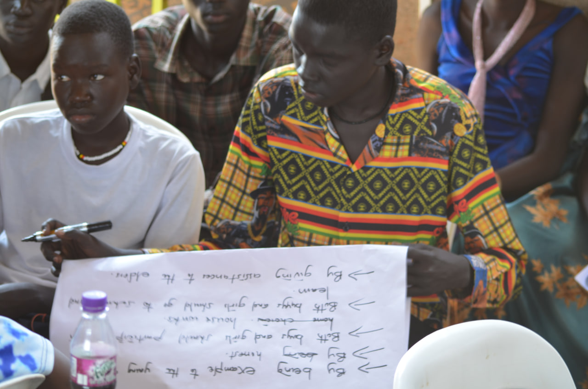

## Vices Of Media Spaces.
Media spaces are electronic settings in which groups of people can work together, even when they are not present in the same place and time by elements of using intergrated videos, audios and computers for example online video games or even meeting rooms are a signifcant features of media spaces currently.
Media spaces and devices have been wrongfully used by individuals therefore training and equipping media users with the relevant skills to navigate this spaces effectively and respectfully is a priority.

## Forms/ Challenges Surrounded By Media Spaces.  
## Digital Bullying.
Digital bullying is bullying with the use of digital technologies. It can take place on social media, messaging platforms, gaming platforms and mobile phones. It is repeated behaviour, aimed at scaring, angering or shaming those who are targeted.Users of media spaces often encounter cyber bullying from counterparts as its a virtual platform of connecting people together aiming at working together examples include;

- Spreading lies about or posting embarrassing photos or videos of someone on social media.
 
- Sending hurtful, abusive or threatening messages, images or videos via messaging platforms( unlawful expression of opinion).
  
- Impersonating someone and sending mean messages to others on their behalf or through fake accounts.
  
- Face-to-face bullying and cyberbullying can often happen alongside each other.All this is harmful as it may result into low self esteem among others.

## Precautions.
Users of media spaces ought to overcome this challenges through;
- Setting up privacy controls so as to restrict who can see your online profiles and messages( maximum privacy).
  
- Creating awareness by educating people about the negative effects and related legal issues associated with digital bullying.
  
- Encourage reporting thus seeking help from others like parents, school authorities, and in cases of threats of harm, from law agencies.
